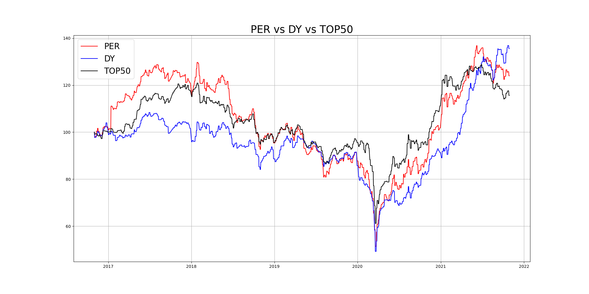

# 📈 저 PER주 & 고배당주 백테스팅

## 📌 개요
이 프로젝트는 **저 PER주**와 **고배당주** 전략의 성과를 비교하고, 이를 시가총액 상위 50개 종목(Benchmark)과 비교하여 분석합니다.  

✅ **저 PER주**: PER(주가수익비율)이 가장 낮은 50개 종목  
✅ **고배당주**: 배당수익률이 가장 높은 50개 종목  
✅ **Benchmark**: 시가총액 상위 50개 종목  

### 📅 분석 기간
- **2016.10.31. ~ 2021.10.31.** 

### 🔄 리밸런싱
- **매년 초** 리밸런싱 진행

---

## 📊 투자 전략

### 1️⃣ 저 PER주 전략
- PER(Price-to-Earnings Ratio)이 가장 낮은 50개 주식 선정
- 일반적으로 저평가된 주식을 찾는 전략  
- 가치투자의 대표적인 방식  

### 2️⃣ 고배당주 전략
- 배당수익률(Dividend Yield)이 가장 높은 50개 주식 선정  
- 안정적인 배당 수익을 추구하는 투자자에게 적합  

### 3️⃣ Benchmark (시총 상위 50개)
- 시장 대표성을 가지는 대형주 포트폴리오  

---

## 🔍 분석 방법
- 백테스팅을 통해 각 전략의 성과를 비교  
- 연간 리밸런싱  
- KISVALUE 데이터를 활용해 분석

---

## 📌 최종 결과
아래 그래프는 각 투자 전략의 성과를 비교한 최종 결과입니다.  

---

## 🛠 데이터 출처
- **KISVALUE**  

